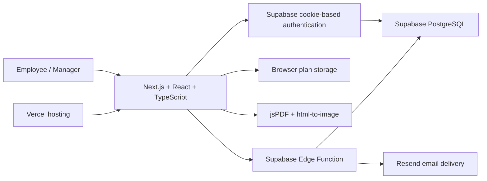

# OakBoard Employee Onboarding Form

This is the canonical OakBoard employee onboarding project.

The canonical application is the Next.js App Router project at the repository root. The previous Vite application was removed after the approved Next.js cutover.

## Architecture



### Repository language profile

GitHub language statistics snapshot (July 21, 2026):

| Language | Share |
|---|---:|
| TypeScript | 59.2% |
| CSS | 33.8% |
| PL/pgSQL | 3.6% |
| PowerShell | 3.2% |
| HTML | 0.2% |

GitHub calculates the sidebar language bar automatically; percentages may change as the codebase evolves.

## Local development

For a complete dependency and service inventory, see `REQUIREMENTS.md`.
For release gates and rollback steps, see `NEXTJS-CUTOVER.md`.

On Windows without administrator access, run the verified portable setup from the repository root:

```powershell
powershell -ExecutionPolicy Bypass -File .\scripts\setup.ps1
```

If the pinned Node.js and npm versions are already available:

```powershell
npm ci
npm run dev
```

Validation commands:

```powershell
npm run build
npm run lint
npm run typecheck
```

## Authentication integration

- Browser and server Supabase clients live in `src/lib/supabase/` and use `@supabase/ssr` cookies.
- `src/proxy.ts` refreshes auth cookies; the protected route-group layout verifies claims server-side.
- Login, email confirmation callbacks, 15-minute freshness, sign-out, and redirects use App Router conventions.

## Secure email delivery

- The email body stays compact and the complete plan is attached as a 1920 x 1080 (16:9) landscape PDF matching the supplied reference.
- PDF generation uses installed React dependencies, so it does not depend on a CDN.
- The Resend API key is no longer present in browser code.
- The Next.js Generate Form page calls the authenticated `send-onboarding-email` Supabase Edge Function.
- The function permits authenticated `@9ostech.com` users, validates the payload, and reads `RESEND_API_KEY` only from server-side environment secrets.
- Deployment and secret configuration are intentionally not performed from this workspace.

## Environment configuration

- Copy `.env.example` to root `.env.local` for local Next.js development.
- Configure the server-side variables listed in `supabase/functions/.env.example` as Supabase Edge Function secrets.
- Never place `RESEND_API_KEY` or `SUPABASE_SERVICE_ROLE_KEY` in the React app or Vercel frontend variables.
- Do not copy `.env.local`, `node_modules/`, or `.next/` between machines; recreate them from the template and lockfile.

## Demo Mode

- Until a custom sending domain is verified, email delivery is locked to `mateen9ostech@gmail.com`.
- CC is disabled in the browser and rejected by the Edge Function.
- The restriction is enforced in both the UI and server-side function, so it cannot be bypassed by editing the form.

## Document output

- The Next.js Generate Form page uses a responsive 16:9 landscape canvas matching the supplied 1920 x 1080 reference.
- The clean PDF button captures the exact visible preview as a high-resolution PNG and places it edge-to-edge on one borderless 16:9 PDF page, avoiding browser headers and layout reflow.
- Two-week plans render and export on one 16:9 page; four-week plans are split into two 16:9 pages with two weeks per page.
- Fill Sample Plan respects the currently selected two-week or four-week duration.
