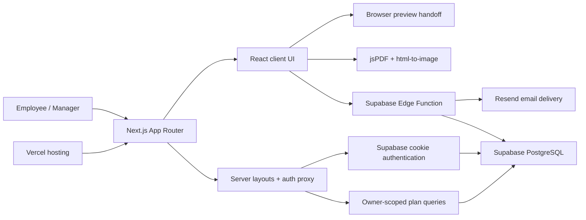

# OakBoard Employee Onboarding Form

> **READ FIRST:** To continue development on this or a new laptop, follow [`START-HERE.md`](START-HERE.md).

This is the canonical OakBoard employee onboarding project.

Production: <https://oak-board-employee-onboarding-form.vercel.app>

The canonical application is the Next.js App Router project at the repository root. The previous Vite application was removed after the approved Next.js cutover.

## Architecture



### Route architecture

Public, authentication, and protected application concerns are separated with App Router route groups. Route groups organize the source without appearing in browser URLs.

```text
src/app/
|-- (public)/
|   |-- page.tsx                         -> /
|   |-- help/page.tsx                    -> /help
|   |-- privacy-policy/page.tsx          -> /privacy-policy
|   `-- terms-of-service/page.tsx        -> /terms-of-service
|-- (auth)/
|   |-- sign-in/page.tsx                 -> /sign-in
|   `-- auth/callback/route.ts            -> /auth/callback
`-- (protected)/
    |-- workspace/page.tsx               -> /workspace
    `-- plans/
        |-- new/page.tsx                 -> /plans/new
        |-- archived/page.tsx            -> /plans/archived
        `-- [planId]/
            |-- page.tsx                 -> /plans/{id}
            `-- edit/page.tsx            -> /plans/{id}/edit
```

Legacy `/login`, `/fill-details`, `/generate-form`, and `/privacy` links are permanently redirected to their current equivalents.

### Repository language profile

GitHub language statistics snapshot (July 21, 2026):

| Language | Share |
|---|---:|
| TypeScript | 60.3% |
| CSS | 32.9% |
| PL/pgSQL | 3.6% |
| PowerShell | 3.1% |
| JavaScript | 0.2% |

GitHub calculates the sidebar language bar automatically; percentages may change as the codebase evolves.

## Local development

For complete new-laptop setup and project handoff notes, see `START-HERE.md`.
For a complete dependency and service inventory, see `REQUIREMENTS.md`.
For release gates and rollback steps, see `NEXTJS-CUTOVER.md`.

On Windows without administrator access, run the verified portable setup from the repository root:

```powershell
powershell -ExecutionPolicy Bypass -File .\scripts\setup.ps1
```

If the pinned Node.js and npm versions are already available:

```powershell
npm ci
npm run dev
```

Validation commands:

```powershell
npm run build
npm run lint
npm run typecheck
npm audit
```

## Authentication integration

- Browser and server Supabase clients live in `src/lib/supabase/` and use `@supabase/ssr` cookies.
- `src/proxy.ts` refreshes auth cookies; the protected route-group layout verifies claims server-side.
- New accounts require a 6-digit email OTP. Successful verification creates the session and opens the protected workspace automatically.
- Login, email verification, confirmation callbacks, 15-minute freshness, sign-out, and redirects use App Router conventions.

### Required Supabase signup OTP configuration

In the hosted Supabase Dashboard, keep **Authentication > Providers > Email > Confirm email** enabled. Then open **Authentication > Email Templates > Confirm signup** and use `{{ .Token }}` in the message body so the email contains the 6-digit code expected by OakBoard. For example:

```html
<h2>Verify your OakBoard account</h2>
<p>Enter this code in OakBoard to finish creating your account:</p>
<p style="font-size: 28px; font-weight: 700; letter-spacing: 6px;">{{ .Token }}</p>
```

Do not replace the OTP with `{{ .ConfirmationURL }}` unless the application is intentionally switched back to link-based confirmation.

## Secure email delivery

- The email body stays compact and the complete plan is attached as a 1920 x 1080 (16:9) landscape PDF matching the supplied reference.
- PDF generation uses installed React dependencies, so it does not depend on a CDN.
- The Resend API key is no longer present in browser code.
- The Next.js Generate Form page calls the authenticated `send-onboarding-email` Supabase Edge Function.
- The function permits authenticated `@9ostech.com` users, validates the payload, and reads `RESEND_API_KEY` only from server-side environment secrets.
- The Next.js application is deployed on Vercel; server-side email secrets remain in Supabase only.

## Environment configuration

- Copy `.env.example` to root `.env.local` for local Next.js development.
- Configure the server-side variables listed in `supabase/functions/.env.example` as Supabase Edge Function secrets.
- Never place `RESEND_API_KEY` or `SUPABASE_SERVICE_ROLE_KEY` in the Next.js app or Vercel frontend variables.
- Do not copy `.env.local`, `node_modules/`, or `.next/` between machines; recreate them from the template and lockfile.

## Demo Mode

- Until a custom sending domain is verified, email delivery is locked to `mateen9ostech@gmail.com`.
- CC is disabled in the browser and rejected by the Edge Function.
- The restriction is enforced in both the UI and server-side function, so it cannot be bypassed by editing the form.

## Document output

- The Next.js Generate Form page uses a responsive 16:9 landscape canvas matching the supplied 1920 x 1080 reference.
- The clean PDF button captures the exact visible preview as a high-resolution PNG and places it edge-to-edge on one borderless 16:9 PDF page, avoiding browser headers and layout reflow.
- Two-week plans render and export on one 16:9 page; four-week plans are split into two 16:9 pages with two weeks per page.
- Fill Sample Plan respects the currently selected two-week or four-week duration.
